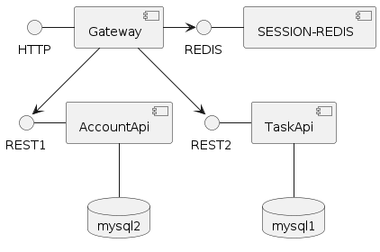

# mini-dooray-d-gateway

> gateway 서버는 모든 서비스 요청을 받으며 프레젠테이션 기능을 담당합니다.

 

- TemplateEngine(Thymeleaf) 사용하여 화면을 표시합니다.

- 데이터는 AccountApi, TaskApi 를 RestTemplate 으로 호출하여 받아 옵니다.

- 화면정보를 표시할때 AccountApi, TaskApi 를 조합해서 제공할 수 있어야 합니다.

- gateway 는 사용자의 인증을 담당합니다.

  - 인증 세션은 gateway 서버에서 redis 를 사용하여 관리합니다.

  - 인증 데이터는 Account-Api 를 사용합니다.

- AccountApi 는 멤버의 정보를 관리합니다.

- ProjectApi 는 Project, Task, Comment, Tag 를 관리 합니다.

 

## 요구사항 정리 

### Auth
- [ ] 로그인 기능  `POST /login`
  - ID / PW
  - GitHub OAuth (추가)
- [ ] 로그아웃 기능   
- [x] 게이트웨이 서버에서 Redis를 사용한 **세션 관리 기능**
  - spring security + spring session
    - security 가 로그인한 사용자 정보( `Authentication` )를 SecurityContext에 저장하고, 
    - SecurityContextPersistenceFilter가 SecurityContext를 현재 HTTP 세션에 저장한다. 
    - spring-session-redis는 현재 세션을 Redis에 저장한다. 

### Routing
- [x] 클라이언트 요청을 Account Api 및 Task Api로 라우팅
- [x] URL 매핑 설정
 
-> FeignClient로 데이터 호출 및 조합 

### 이슈
- `public record UserRoleUpdateRequest(List<String> emails, String role) {}`
  - 보통 부분 업데이트는 HTTP PATCH 메서드를 사용해 UserUpdateRequest Dto객체를 채워서 전송하지만, 
    지금은 클라이언트가 보낸 이메일 목록을 기반으로 역할을 한번에 변경하고 있다. 
  - 장점
    1. 성능 최적화 : 데이터베이스 쿼리와 트랜잭션을 최소화하여 성능을 최적화 
    2. 네트워크 효율성 : 그냥..  데이터 전송을 최소화시켯음 
    3. 코드 간결성 : 로직 단순 

- User 테이블의 `role` 필드 
  - 1차적인 접근 제어 역할
  - Spring Security를 통해 기본적인 역할 기반 접근 제어를 설정함으로써, 비즈니스 로직에 진입하기 전에 기본적인 권한 검사를 수행
  - role의 우선순위 : `PROJECT_ADMIN`, `PROJECT_MEMBER`, `MEMBER`
    - 하나의 프로젝트라도 생성한 적이 있다면 바로 `PROJECT_ADMIN`이 돼서 해당 프로젝트에 대한 권한이 있는 지는 비즈니스로직에서 확인해야해 한다. 
    - 그럼에도 spring security에서 접근 제어를 미리 설정해서, 비즈니스 로직에 불필요하게 접근하는 걸 막을 수 있으며 
  - 장점
    1. 접근 제어 : 1차 캐시 역할 
    2. 성능 및 보안 최적화 : 기본적인 접근 제한을 통해 불필요한 비즈니스로직 실행을 최소화

- FeignClient - 페이징네이션
  - FeignClient로 요청할 때 `Pageable`객체를 그대로 사용할 수는 없다. 
  - `Pageable`은 스프링 Data의 인터페이스로 HTTP 요청에 직접 포함하기 위해선 적절한 변환이 필요하다. 
    - -> 보통 쿼리 파라미터를 사용해서 페이징 정보를 전달한다. 
